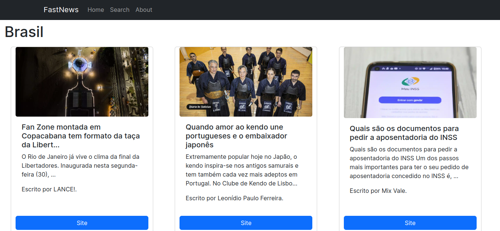

# FastNews



> Site de notícias sobre diversos temas: Brasil, Futebol, Europa e muito mais. Pesquise por temas especificos ou vejas os destaques na pagina inicial.


## 💻 Pré-requisitos

Antes de começar, verifique se você atendeu aos seguintes requisitos:

* Você instalou a versão mais recente do Node js.
* Você possui o npm instalado (gerenciador de pacotes do node).
* Você é cadastrado na NewsApi (https://newsapi.org/)

## 🚀 Instalando FastNews

Para instalar o FastNews, siga estas etapas:

```
npm install
```


## ☕ Usando FastNews

Para usar FastNews, siga estas etapas:

Passo 1: Crie um arquivo chamado 'my_env.js' na pasta app.

Passo2: Escreva o seguinte código no arquivo, substituindo a string vazia pela sua chave da NewsApi:
```
let apikey = " ";
export default apikey;
```

Passo 3: Inicie o projeto, escrevendo o seguinte código no terminal:

```
npm run dev
```

## 🤝 Colaboradores


<table>
  <tr>
    <td align="center">
      <a href="#">
        <br>
        <sub>
          <b>José Henrique</b>
        </sub>
      </a>
    </td>
  </tr>
</table>


