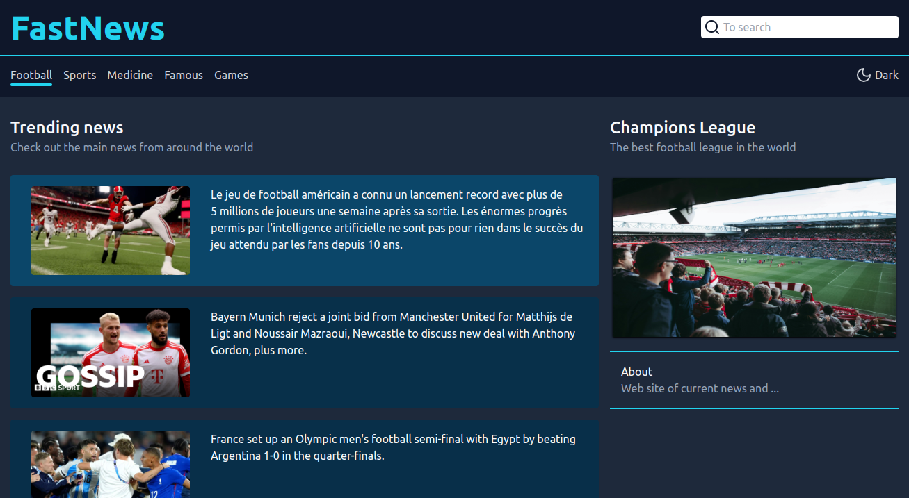

# Fastnews



> Site de notícias sobre diversos temas: Futebol, games, famosos e muito mais. Pesquise por temas especificos ou veja o slider, além disso, você pode trocar o tema da página.


## 💻 Pré-requisitos

Antes de começar, verifique se você atendeu aos seguintes requisitos:

* Você instalou o `Node`;
* Você possui a apiKey no site [NewsApi](https://newsapi.org/docs/get-started).

## 🚀 Instalando Fastnews

Para instalar o Fastnews, siga estas etapas:

```
npm i
```

Renomear o `env.example` para `.env` e preencher os seguintes campos
```
VITE_API="https://newsapi.org/v2"
VITE_API_KEY="sua api key"
```

## ☕ Usando Fastnews

Para usar Fastnews, siga estas etapas:

```
npm run dev
```


## 🤝 Colaboradores


<table>
  <tr>
    <td align="center">
      <a href="#">
        <br>
        <sub>
          <b>José Henrique</b>
        </sub>
      </a>
    </td>
  </tr>
</table>
